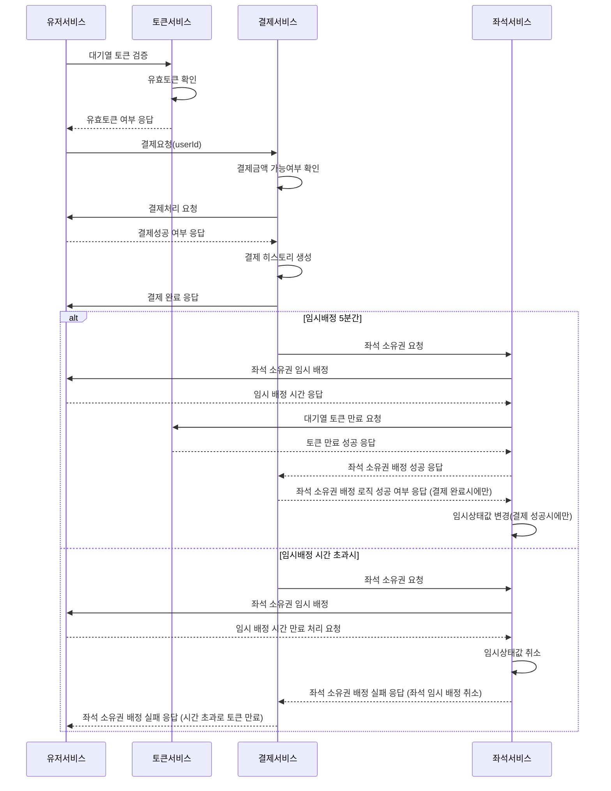

```mermaid
sequenceDiagram
    participant 유저서비스
    participant 토큰서비스
    participant 결제서비스
    participant 좌석서비스
    유저서비스->>토큰서비스 : 대기열 토큰 검증
    토큰서비스->>토큰서비스 : 유효토큰 확인
    토큰서비스-->>유저서비스 : 유효토큰 여부 응답
    유저서비스->>결제서비스 : 결제요청(userId)
    결제서비스->>결제서비스 : 결제금액 가능여부 확인
    결제서비스->>유저서비스 : 결제처리 요청
    유저서비스-->>결제서비스 : 결제성공 여부 응답
    결제서비스->>결제서비스 : 결제 히스토리 생성
    결제서비스->>유저서비스 : 결제 완료 응답
    alt 임시배정 5분간
        결제서비스->>좌석서비스: 좌석 소유권 요청
        좌석서비스->>유저서비스: 좌석 소유권 임시 배정
        유저서비스-->>좌석서비스: 임시 배정 시간 응답
        좌석서비스->>토큰서비스: 대기열 토큰 만료 요청
        토큰서비스-->>좌석서비스: 토큰 만료 성공 응답
        좌석서비스-->>결제서비스: 좌석 소유권 배정 성공 응답
        결제서비스-->>좌석서비스: 좌석 소유권 배정 로직 성공 여부 응답 (결제 완료시에만)
        좌석서비스->>좌석서비스:임시상태값 변경(결제 성공시에만)
    else 임시배정 시간 초과시
        결제서비스->>좌석서비스: 좌석 소유권 요청 
        좌석서비스->>유저서비스: 좌석 소유권 임시 배정
        유저서비스-->>좌석서비스: 임시 배정 시간 만료 처리 요청
        좌석서비스->>좌석서비스:임시상태값 취소
        좌석서비스-->>결제서비스: 좌석 소유권 배정 실패 응답 (좌석 임시 배정 취소)
        결제서비스-->>유저서비스: 좌석 소유권 배정 실패 응답 (시간 초과로 토큰 만료)
    end
```