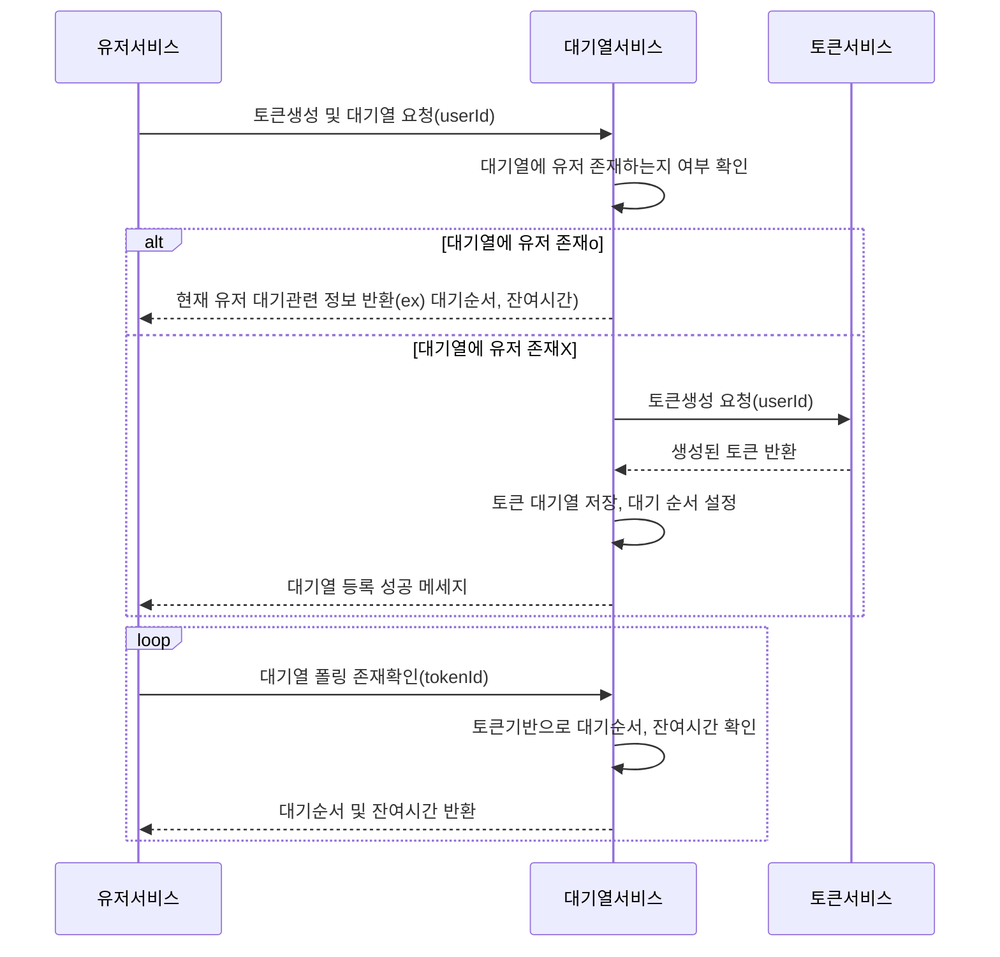

```mermaid
    sequenceDiagram
        participant 유저서비스
        participant 대기열서비스
        participant 토큰서비스
        유저서비스->>대기열서비스 : 토큰생성 및 대기열 요청(userId)
        대기열서비스->>대기열서비스 : 대기열에 유저 존재하는지 여부 확인 
        alt 대기열에 유저 존재o 
            대기열서비스-->>유저서비스 : 현재 유저 대기관련 정보 반환(ex) 대기순서, 잔여시간) 
        else 대기열에 유저 존재X
            대기열서비스->>토큰서비스 : 토큰생성 요청(userId)
            토큰서비스-->>대기열서비스 : 생성된 토큰 반환 
            대기열서비스->>대기열서비스 : 토큰 대기열 저장, 대기 순서 설정
            대기열서비스-->>유저서비스 : 대기열 등록 성공 메세지 
        end
        loop 
            유저서비스->>대기열서비스 : 대기열 폴링 존재확인(tokenId)
            대기열서비스->>대기열서비스 : 토큰기반으로 대기순서, 잔여시간 확인
            대기열서비스-->>유저서비스: 대기순서 및 잔여시간 반환
        end
```

