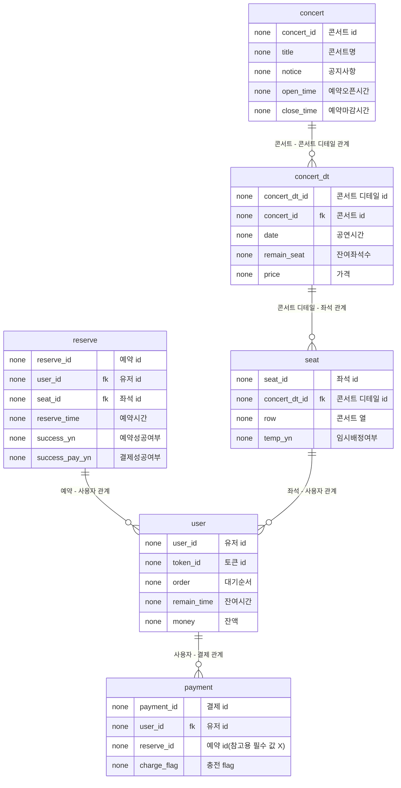

```mermaid
erDiagram

    %% 사용자 테이블
    user {
        none user_id "유저 id"
        none token_id "토큰 id"
        none order "대기순서"
        none remain_time "잔여시간"
        none money "잔액"
    }
    %% 콘서트 테이블
    concert {
        none concert_id "콘서트 id"
        none title "콘서트명"
        none notice "공지사항"
        none open_time "예약오픈시간"
        none close_time "예약마감시간"
    }

    %% 콘서트 디테일 테이블
    concert_dt {
        none concert_dt_id "콘서트 디테일 id"
        none concert_id fk "콘서트 id"
        none date "공연시간"
        none remain_seat "잔여좌석수"
        none price "가격"
    }

    %% 좌석 테이블
    seat {
        none seat_id "좌석 id"
        none concert_dt_id fk "콘서트 디테일 id"
        none row "콘서트 열"
        none temp_yn "임시배정여부"
    }
    
    %% 예약 테이블
    reserve {
        none reserve_id "예약 id"
        none user_id fk "유저 id"
        none seat_id fk "좌석 id"
        none reserve_time "예약시간"
        none success_yn "예약성공여부"
        none success_pay_yn "결제성공여부"
    }
    
    %% 결제 테이블
    payment {
        none payment_id "결제 id"
        none user_id fk "유저 id"
        none reserve_id "예약 id(참고용 필수 값 X)"
        none charge_flag  "충전 flag"
    }

    %% 관계 정의
    user ||--o{ payment : "사용자 - 결제 관계"
    reserve ||--o{ user : "예약 - 사용자 관계"
    seat ||--o{ user : "좌석 - 사용자 관계"
    concert ||--o{ concert_dt : "콘서트 - 콘서트 디테일 관계"
    concert_dt ||--o{ seat : "콘서트 디테일 - 좌석 관계"

```
