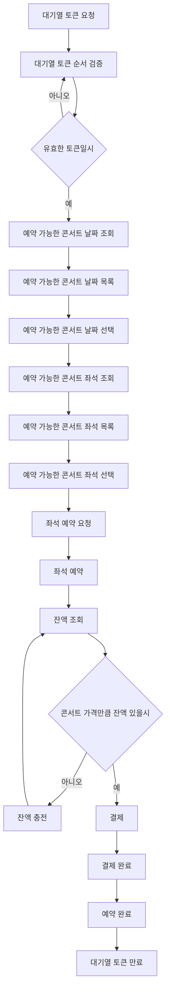

## 콘서트 예약시 플로우차트

```mermaid
graph TD
    E[대기열 토큰 요청] --> F[대기열 토큰 순서 검증]
    F --> G{유효한 토큰일시}
    G -- 아니오 --> F
    G -- 예 --> H[예약 가능한 콘서트 날짜 조회]
    H --> I[예약 가능한 콘서트 날짜 목록]
    I --> J[예약 가능한 콘서트 날짜 선택]
    J --> K[예약 가능한 콘서트 좌석 조회]
    K --> L[예약 가능한 콘서트 좌석 목록]
    L --> M[예약 가능한 콘서트 좌석 선택]
    M --> N[좌석 예약 요청]
    N --> O[좌석 예약]
    O --> P[잔액 조회]
    P --> Q{콘서트 가격만큼 잔액 있을시}
    Q -- 아니오 --> R[잔액 충전]
    Q -- 예 --> S[결제]
    R --> P
    S --> T[결제 완료]
    T --> U[예약 완료]
    U --> V[대기열 토큰 만료]
```