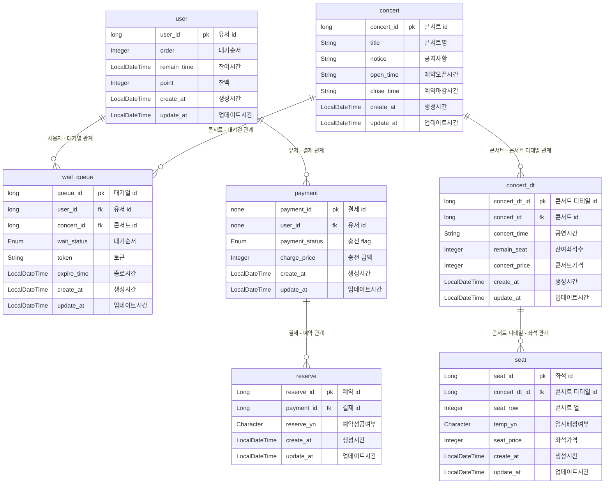

```mermaid

erDiagram

    %% 사용자 테이블
    user {
        long user_id pk "유저 id"
        Integer order "대기순서"
        LocalDateTime remain_time "잔여시간"
        Integer point "잔액"
        LocalDateTime create_at "생성시간"
        LocalDateTime update_at "업데이트시간"
    }

    %% 대기열 테이블
    wait_queue {
        long queue_id pk "대기열 id"
        long user_id fk "유저 id"
        long concert_id fk "콘서트 id"
        Enum wait_status "대기순서"
        String token "토큰"
        LocalDateTime expire_time "종료시간"
        LocalDateTime create_at "생성시간"
        LocalDateTime update_at "업데이트시간"
    }

    %% 콘서트 테이블
    concert {
        long concert_id pk "콘서트 id"
        String title "콘서트명"
        String notice "공지사항"
        String open_time "예약오픈시간"
        String close_time "예약마감시간"
        LocalDateTime create_at "생성시간"
        LocalDateTime update_at "업데이트시간"
    }

    %% 콘서트 디테일 테이블
    concert_dt {
        long concert_dt_id pk "콘서트 디테일 id"
        long concert_id fk "콘서트 id"
        String concert_time "공연시간"
        Integer remain_seat "잔여좌석수"
        Integer concert_price "콘서트가격"
        LocalDateTime create_at "생성시간"
        LocalDateTime update_at "업데이트시간"
    }

    %% 좌석 테이블
    seat {
        Long seat_id pk "좌석 id"
        Long concert_dt_id fk "콘서트 디테일 id"
        Integer seat_row "콘서트 열"
        Character temp_yn "임시배정여부"
        Integer seat_price "좌석가격"
        LocalDateTime create_at "생성시간"
        LocalDateTime update_at "업데이트시간"
    }
    
    %% 예약 테이블
    reserve {
        Long reserve_id pk "예약 id"
        Long payment_id fk "결제 id"
        Character reserve_yn "예약성공여부"
        LocalDateTime create_at "생성시간"
        LocalDateTime update_at "업데이트시간"
    }
    
    %% 결제 테이블
    payment {
        none payment_id pk "결제 id"
        none user_id fk "유저 id"
        Enum payment_status  "충전 flag"
        Integer charge_price  "충전 금액"
        LocalDateTime create_at "생성시간"
        LocalDateTime update_at "업데이트시간"
    }

    %% 관계 정의
    user ||--o{ payment : "유저 - 결제 관계"
    payment ||--o{ reserve : "결제 - 예약 관계"
    concert ||--o{ concert_dt : "콘서트 - 콘서트 디테일 관계"
    concert_dt ||--o{ seat : "콘서트 디테일 - 좌석 관계"
    user ||--o{ wait_queue : "사용자 - 대기열 관계"
    concert ||--o{ wait_queue : "콘서트 - 대기열 관계"

```